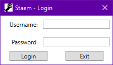
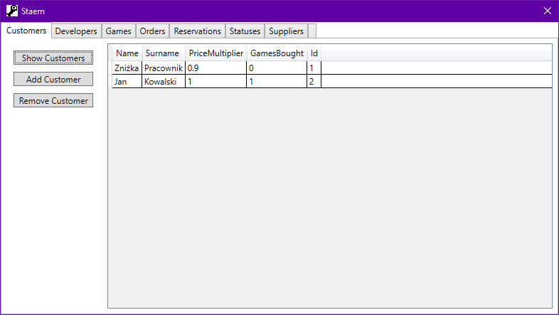
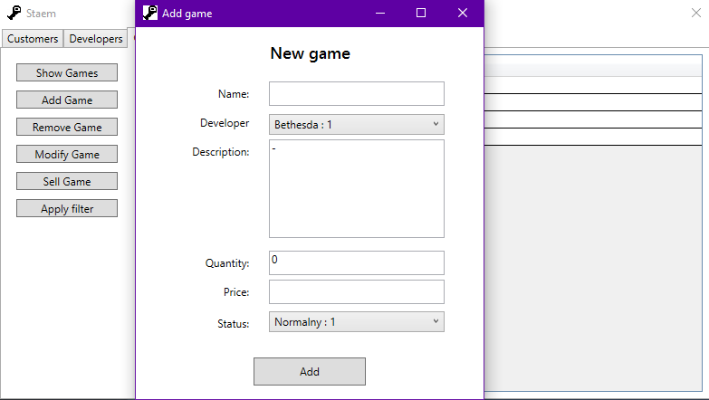
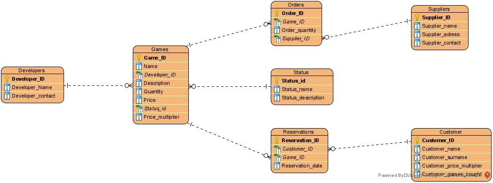

# Staem
> WPF Application with MySQL database server connection.

## Table of contents
- [Staem](#staem)
  - [Table of contents](#table-of-contents)
  - [General info](#general-info)
  - [Screenshots](#screenshots)
  - [Technologies](#technologies)
  - [Setup and run](#setup-and-run)
  - [Features](#features)
  - [Status](#status)
  - [Contact](#contact)

## General info
The purpose of project was to learn how to write an application, that communicates with database stored on server. First we have created database from scratch and uploaded it to the server. Then we have programmed WPF application that connects to the server. The application is not fully functional; however, it allows user to execute basic use cases. All in all, whole project was great learning experience.

## Screenshots








## Technologies
* MySQL Workbench 8.0.22 for MySQL database project.
* MYSQL Server 8.0.22 for local database server. 
* MySQL Conector/NET 8.0.22 library for connection beetwen application and database server.
* WPF .Net Framework 4.7.2 for application (Visual Studio 2019).
  
Application runs on Windows system (developed and tested on Windows 10).

## Setup and run
1. Download repository.
2. Download and install tools ([Technologies](#technologies)).
3. Configure MySQL Server as follows:
   
```
Connection Method:  Standard (TCP/IP)
Hostname:           127.0.0.1
Port:               3306
Username:           root
Password:           root
```
4. Launch server.
5. Upload [database code](./DatabaseProject/staem.sql) as new schema.
6. Build WPF application using Viusal Studio.
7. Launch application.
8. Login as `username: root` and `password: root`.

## Features
This application in not fully functional. It realizes following use cases:
* Login to application and database.
* Display database content.
* Add new game.
* Remove game.
* Modify game.
* Sell game.
* Reserve game.
* Add new order.
* Add new customer.
* Set discount.

## Status
This project is no longer developed.

## Contact
Created by [@michaltkacz](https://github.com/michaltkacz) and [@MichalSkubek](https://github.com/MichalSkubek) - feel free to contact us!